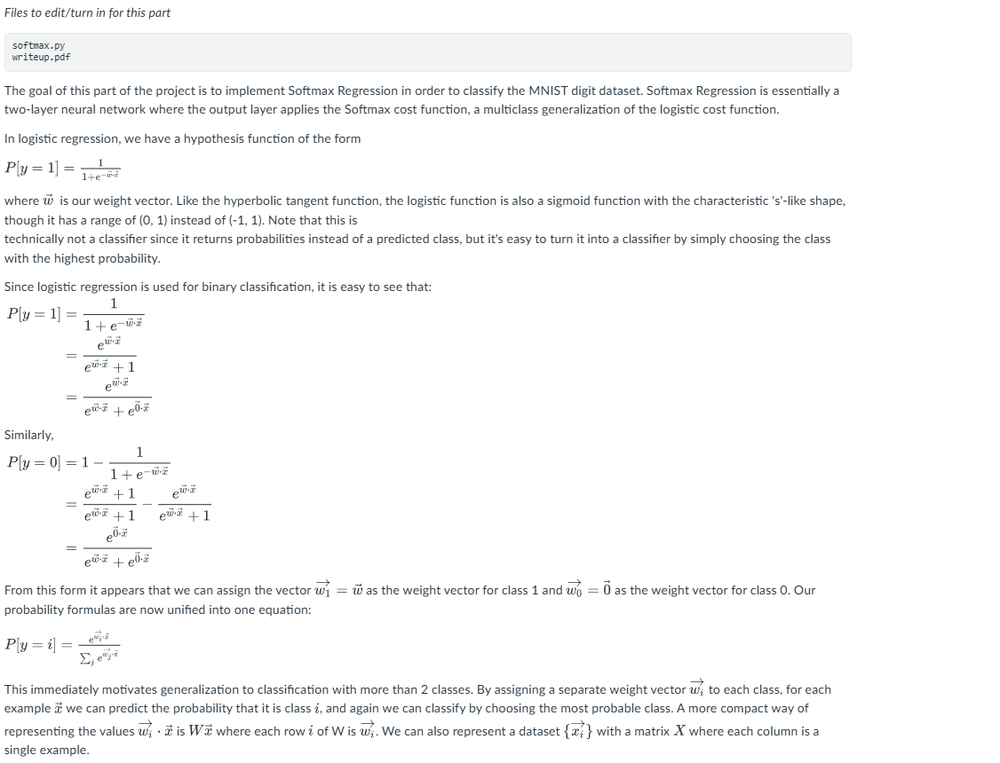
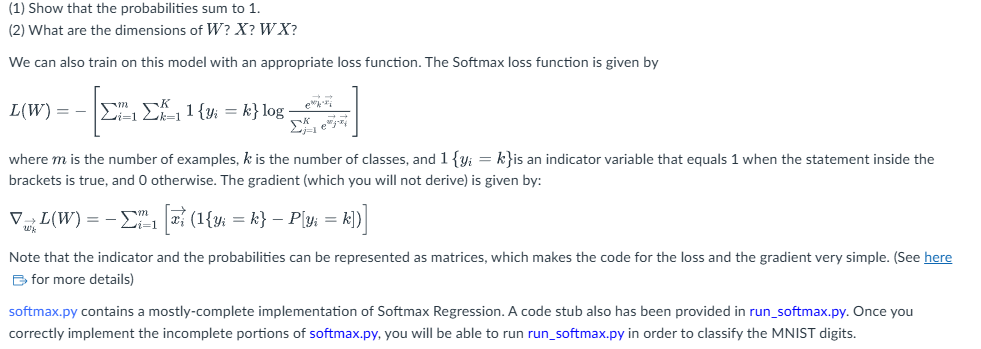
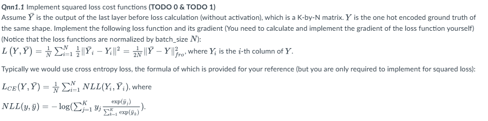

# Project 3: PCA, Softmax Regression and NN
====================================================
In this project, we will explore dimensionality reduction (PCA), softmax regression and neural networks.
Files to turn in:
```bash
dr.py           Implementation of PCA
softmax.py      Implementation of softmax regression
nn.py           Implementation of fully connected neural network
writeup.pdf     Answers all the written questions in this assignment 
Files you created for Extra-Credits
```
You will be using helper functions in the following .py files and datasets:
```bash
util.py         Helper functions for PCA
datasets.py     Helper functions for PCA
utils.py        Helper functions for Softmax Regression and NN
digits          Toy dataset for PCA
data/*          Training and dev data for SR and NN
```
Please do not change the file names listed above. 

Please do not change the names of any provided functions or classes within the code. The correctness of your implementation will be the final judge of your score. Please do not import (potentially unsafe) system-related modules such as sys, exec, eval... Otherwise we will assign a zero point without grading.

## Part 1    PCA [30%]
Files you might want to look at for PCA:

```bash
datasets.py     Some simple toy data sets
digits          Digits data
util.py        Utility functions, plotting, etc.
```

Our first tasks are to implement PCA. If implemented correctly, these should be 5-line functions (plus the supporting code I've provided): just be sure to use numpy's eigenvalue computation code. Implement PCA in the function `pca` in `dr.py`.

The pseudo-code in Algorithm 37 in CIML demonstrates the role of covariance matrix in PCA. However, the implementation of covariance matrix in practice requires much more concerns. One of them is to decide whether we require an unbiased estimation of the covariance matrix, i.e. normalize D by (N-1) instead of N (biased). Even the popular packages, such as matlab and sklearn, differ in the implementation. To make things easy, we'll require the submitted code to implement an unbiased version. More references: [PCA tutorial](https://ourarchive.otago.ac.nz/esploro/outputs/report/A-tutorial-on-Principal-Components-Analysis/9926479584201891#file-0), [Sample mean and covariance.](https://en.wikipedia.org/wiki/Sample_mean_and_covariance). Using sklearn.decomposition.PCA or numpy.cov is prohibited. Read the comments in dr.py carefully.

### Qpca1 (15%) Implement PCA

Our first test of PCA will be on Gaussian data with a known covariance matrix. First, let's generate some data and see how it looks, and see what the sample covariance is:
```bash
>>> from numpy import *
>>> from matplotlib.pyplot import *
>>> import util
>>> Si = util.sqrtm(array([[3,2],[2,4]]))
>>> x = dot(random.randn(1000,2), Si)
>>> plot(x[:,0], x[:,1], 'b.')
>>> show(False)
>>> dot(x.T,x) / real(x.shape[0]-1) # The sample covariance matrix. Random generated data cause result to vary
array([[ 3.01879339,  2.07256783],
       [ 2.07256783,  4.15089407]])
```

(Note: The reason we have to do a matrix square-root on the covariance is because Gaussians are transformed by standard deviations, not by covariances.)

Note that the sample covariance of the data is almost exactly the true covariance of the data. If you run this with 100,000 data points (instead of 1000), you should get something even closer to `[[3,2],[2,4]]`.

Now, let's run PCA on this data. We basically know what should happen, but let's make sure it happens anyway (still, given the random nature, the numbers won't be exactly the same).
```bash
>>> import dr
>>> (P,Z,evals) = dr.pca(x, 2)
>>> Z
array([[-0.60270316, -0.79796548],
       [-0.79796548,  0.60270316]])
>>> evals
array([ 5.72199341,  1.45051781])
```
This tells us that the largest eigenvalue corresponds to the direction `[-0.603, -0.798]` and the second largest corresponds to the direction `[-0.798, 0.603]`. We can project the data onto the first eigenvalue and plot it in red, and the second eigenvalue in green. (Unfortunately we have to do some ugly reshaping to get dimensions to match up.)

```bash
>>> x0 = dot(dot(x, Z[:,0]).reshape(1000,1), Z[:,0].reshape(1,2))
>>> x1 = dot(dot(x, Z[:,1]).reshape(1000,1), Z[:,1].reshape(1,2))
>>> plot(x[:,0], x[:,1], 'b.', x0[:,0], x0[:,1], 'r.', x1[:,0], x1[:,1], 'g.')
>>> show(False)
``` 
Now, back to digits data. Let's look at some "eigendigits." (These numbers should be exact match)

```bash
>>> import datasets
>>> (X,Y) = datasets.loadDigits()
>>> (P,Z,evals) = dr.pca(X, 784)
>>> evals
array([ 0.05471459,  0.04324574,  0.03918324,  0.03075898,  0.02972407, .....
```

Eventually, the eigenvalues drop to zero (some may be negative due to floating point errors).

### Qpca2 (10%): Plot the normalized eigenvalues (include the plot in your writeup). How many eigenvectors do you have to include before you've accounted for 90% of the variance? 95%? (Hint: see function cumsum.)

Now, let's plot the top 50 eigenvectors:
```bash
>>> util.drawDigits(Z.T[:50,:], arange(50))
>>> show(False)
```
### Qpca3 (5%): Do these look like digits? Should they? Why or why not? (Include the plot in your write-up.) (Make sure you have got rid of the imaginary part in pca.)

## Part II    Softmax Regression [45%] 

### Qsr1(10%)

### Qrs2()
(1) Complete the implementation of the cost function.
(2) Complete the implementation of the predict function.

Check your implementation by running:
```bash
>>> python run_softmax.py
```
The output should be:
```bash
RUNNING THE L-BFGS-B CODE

* * *

Machine precision = 2.220D-16
N = 7840 M = 10

At X0 0 variables are exactly at the bounds

At iterate 0 f= 2.30259D+00 |proj g|= 6.37317D-02

At iterate 1 f= 1.52910D+00 |proj g|= 6.91122D-02

At iterate 2 f= 7.72038D-01 |proj g|= 4.43378D-02

...

At iterate 401 f= 2.19686D-01 |proj g|= 2.52336D-04

At iterate 402 f= 2.19665D-01 |proj g|= 2.04576D-04

* * *

Tit = total number of iterations
Tnf = total number of function evaluations
Tnint = total number of segments explored during Cauchy searches
Skip = number of BFGS updates skipped
Nact = number of active bounds at final generalized Cauchy point
Projg = norm of the final projected gradient
F = final function value

* * *

N Tit Tnf Tnint Skip Nact Projg F
7840 402 431 1 0 0 2.046D-04 2.197D-01
F = 0.21966482316858085

STOP: TOTAL NO. of ITERATIONS EXCEEDS LIMIT

Cauchy time 0.000E+00 seconds.
Subspace minimization time 0.000E+00 seconds.
Line search time 0.000E+00 seconds.

Total User time 0.000E+00 seconds.

Accuracy: 93.99%
```
### Qsr3 (10%)

In the cost function, we see the line
```bash
W_X = W_X - np.max(W_X)
```
This means that each entry is reduced by the largest entry in the matrix.
(1) Show that this does not affect the predicted probabilities.
(2) Why might this be an optimization over using W_X? Justify your answer.

### Qsr4 (10%)

Use the learningCurve function in runClassifier.py to plot the accuracy of the classifier as a function of the number of examples seen. Include the plot in your write-up. Do you observe any overfitting or underfitting? Discuss and expain what you observe.

## Part III NN [25% and Extra 15%]
Files to edit/turn in.
```bash
nn.py     
writeup.pdf
files created for the Q2 extra credits
```
In this part of the project, we'll implement a fully-connected neural network in general for the MNIST dataset. For `Qnn1`  you will complete nn.py. For `Qnn2`, create your own files.

A code stub also has been provided in run_nn.py. Once you correctly implement the incomplete portions of nn.py, you will be able to run run_nn.py in order to classify the MNIST digits.

The dataset is included under ./data. You will be using the following helper functions in "utils.py". In the following description, let `K, N, d` denote the number of classes, number of samples and number of features. 

Selected functions in "utils.py"
```bash
loadMNIST(image_file, label_file) #returns data matrix X with shape (d, N) and labels with shape (N,)
onehot(labels) # encodes labels into one hot style with shape (K,N)
acc(pred_label, Y) # calculate the accuracy of prediction given ground truth Y, where pred_label is with shape (N,), Y is with shape (N,K).
data_loader(X, Y=None, batch_size=64, shuffle=False) # Iterator that yield X,Y with shape(d, batch_size) and (K, batch_size).
```
### Qnn1 (20% for Qnn1.1, 1.2, 1.3 and 5% for Qnn 1.4) Implement the NN

The scaffold has been built for you. Initialize the model and print the architecture with the following:
```bash
 >>> from nn import NN, Relu, Linear, SquaredLoss
 >>> from utils import data_loader, acc, save_plot, loadMNIST, onehot
 >>> model = NN(Relu(), SquaredLoss(), hidden_layers=[128,128])
 >>> model.print_model()
 ```
Two activation functions (Relu, Linear) and self.predict(X) have been implemented for you.
#### Qnn1.1

#### Qnn1.2: Compute the gradients (TODO 2 & TODO 3)
Implement the forward pass (TODO 2) and back propagation (TODO 3) for gradient calculation. Use "activation.activate" and "activation.backprop_grad" in your code so that your gradient computation works for different choices of activation functions.
Do the following to see if the loss goes down.

```bash
>>> x_train, label_train = loadMNIST('data/train-images.idx3-ubyte', 'data/train-labels.idx1-ubyte')
>>> x_test, label_test = loadMNIST('data/t10k-images.idx3-ubyte', 'data/t10k-labels.idx1-ubyte')
>>> y_train = onehot(label_train)
>>> y_test = onehot(label_test) 

>>> model = NN(Relu(), SquaredLoss(), hidden_layers=[128, 128], input_d=784, output_d=10)
>>> model.print_model()
>>> training_data, dev_data = {"X":x_train, "Y":y_train}, {"X":x_test, "Y":y_test}
>>> from run_nn import train_1pass
>>> model, plot_dict = train_1pass(model, training_data, dev_data, learning_rate=1e-2, batch_size=64)
```

#### Qnn1.3 Run in epochs

An epoch is a full pass of the training data. Run run_nn.py. 
```bash 
>>> python3 run_nn.py
```
Report your final accuracy on the dev set. You can either use the default setting or tune the architecture (number of layers, size of layers and loss function) and hyperparameters (lr, batch_size, max_epoch).

#### Qnn1.4 (No implementation needed for this question). When initializing the weight matrix, in some cases it may be appropriate to initialize the entries as small random numbers rather than all zeros.  Give one reason why this may be a good idea.

### Qnn2:
Choose one of the following directions (outside research may be required) for further exploration (Feel free to copy nn.py, utils.py and run_nn.py as a starting point. Make sure that your code for Qnn2 is separated from your code for Qnn1):


(1) Do dimension reduction with PCA. Try with different dimensions. Can you observe the trade-off in time and acc? Plot training time v.s. dimension, testing time v.s dimension and acc v.s. dimension. Visualize the principal components. 

(2) Improve your results with ensemble methods. Describe your implementation. Can you observe improved performance compared with that of Q4? Why? (http://ciml.info/dl/v0_99/ciml-v0_99-ch13.pdf)

(3) Implement a new optimizer (By implementing a different self.update for the NN class). Compare with the original SGD optimizer. You can read about the optimizers in (http://ruder.io/deep-learning-optimization-2017/). Does this new method take less number of samples to converge? Does this new method take less time to converge?

Qnn2.1 Explain what you did and what you found. Comment the code so that it is easy to follow. Support your results with plots and numbers. Provide the implementation so we can replicate your results.